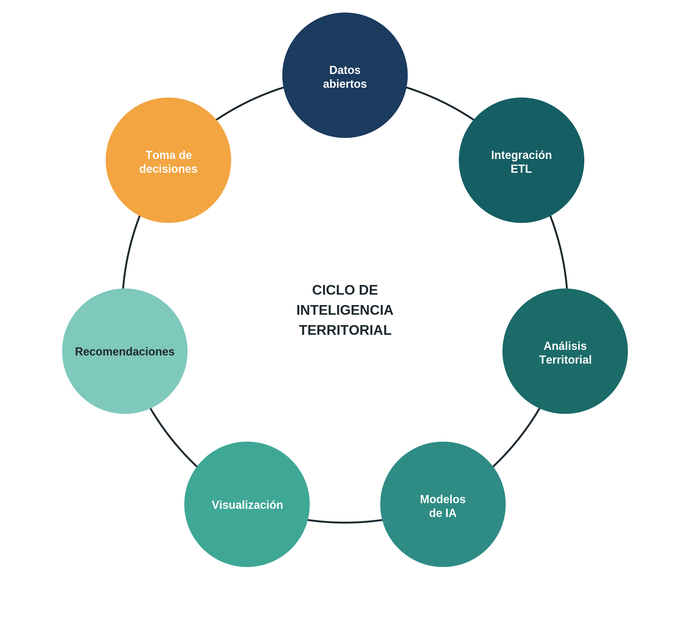
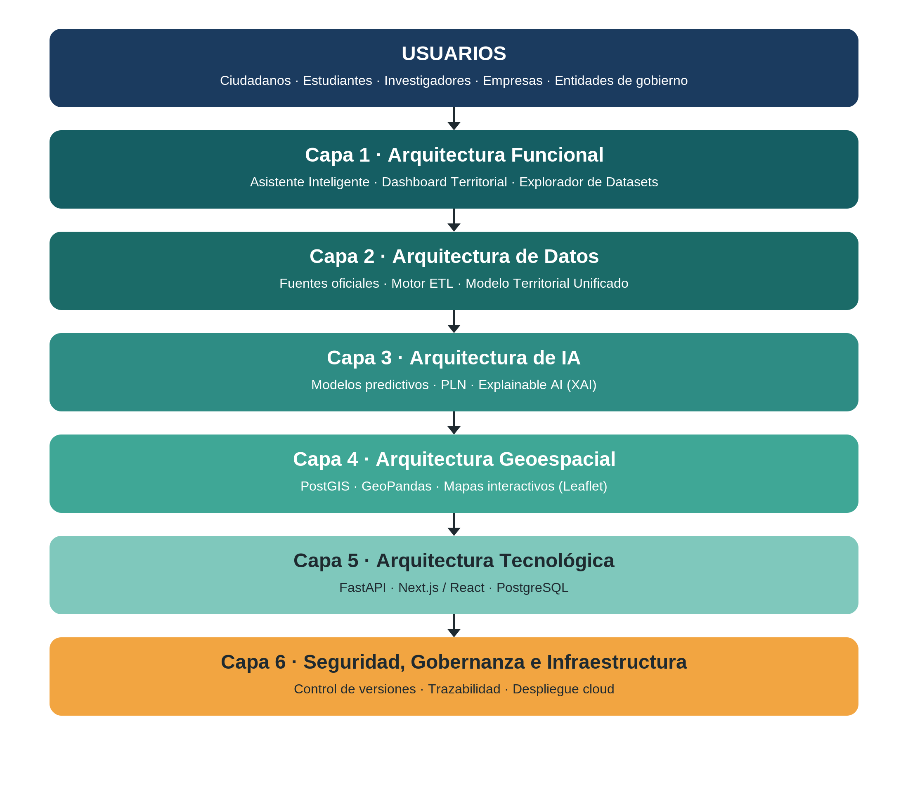

<div align="center">

# 🌎 Kwesx AI

### Inteligencia territorial que traduce los datos abiertos de Colombia al lenguaje de quien decide

*«Kwesx» significa «nosotros» en lengua nasa. Este proyecto es para todos.*

<br>

[](https://datos.gov.co)

[](https://python.org)
[](https://fastapi.tiangolo.com)
[](https://nextjs.org)
[](https://postgresql.org)
[](https://www.w3.org/WAI/WCAG22/quickref/)
[](LICENSE)

</div>

---

<div align="center">

### 🎤 ¿Eres del jurado? Empieza por aquí

**📊 Presentación del proyecto (pitch deck · 15 diapositivas):**
### 👉 [`docs/figuras/Presentación Kwesx IA.pptx`](docs/figuras/Presentaci%C3%B3n%20Kwesx%20IA.pptx)

*GitHub no previsualiza PowerPoint. Ábrela con «Download» / «View raw», o descárgala del repositorio.*

</div>

---

> **Doña Carmen cultiva yuca y maíz en Norte de Santander.**
> Un día los fertilizantes subieron **18 %** sin que ella lo supiera. El dato **sí** estaba publicado en datos.gov.co — pero en un formato técnico que nadie en el campo podía leer. Perdió el **40 %** de su cosecha.
>
> **El problema no es que los datos no existan. Es que nunca llegan a quien los necesita.**
> Es un problema de traducción, no de tecnología. Ese vacío es el que Kwesx AI existe para cerrar.

---

## ¿Qué es Kwesx AI?

Kwesx AI convierte datos abiertos del Estado colombiano en **inteligencia territorial comprensible**: toma cinco fuentes oficiales, las cruza en un solo modelo por municipio usando el **Código DANE** como llave maestra, las pasa por cinco modelos de IA y entrega el resultado en dos idiomas — el del analista y el del campesino.

El usuario **nunca consulta una base de datos.** Le pregunta a un sistema que conoce su territorio.

> **No es un dashboard. No es un chatbot. Es inteligencia territorial:** información contextualizada, predictiva y traducida.

<div align="center">
<br>

<br>
<em>Del API oficial a la decisión del ciudadano — el ciclo de inteligencia territorial.</em>
<br><br>
</div>

---

## ⚙️ Qué hace de verdad hoy

Este repositorio **no es una maqueta.** Los cinco modelos están **implementados y entrenados** (última corrida: 13 jul 2026) y el frontend consume sus endpoints.

| Módulo | Técnica | Qué entrega | Estado |
|---|---|---|:--:|
| **Predicción IVT** | Ensemble Random Forest + XGBoost | Índice de Vulnerabilidad Territorial: `BAJA` · `MEDIA` · `ALTA` | ✅ |
| **Clustering territorial** | KMeans + DBSCAN | Agrupa períodos/territorios en 7 perfiles de riesgo | ✅ |
| **Forecasting de precios** | Holt-Winters + SARIMA | Proyección de índices a 6 meses | ✅ |
| **Detección de anomalías** | Isolation Forest | Alertas ante cifras atípicas | ✅ |
| **Explicabilidad (XAI)** | SHAP | Justifica cada predicción — no es una caja negra | ✅ |
| **Asistente conversacional** | TF-IDF + similitud coseno *(keyword como respaldo)* | Interpreta preguntas en español y responde con datos | ✅ |

Detalle técnico de cada modelo → [`docs/ML.md`](docs/ML.md)

---

## 📊 Resultados reales

Métricas de la última corrida de entrenamiento, guardadas en [`ml/models/*_metadata.json`](ml/models/). **Están sin maquillar a propósito** — la transparencia vale más que un número inflado.

### Modelo IVT — clasificación de riesgo territorial

| Métrica | Ensemble (RF + XGBoost) | XGBoost solo |
|---|:--:|:--:|
| Accuracy (test) | 72.2 % | **77.8 %** |
| F1-macro (test) | 0.51 | **0.75** |
| Validación cruzada (5-fold) | 0.49 ± 0.08 | — |

**Variables más influyentes:** subíndice de fertilizantes UPRA (**0.22**), índice total UPRA (0.19), variación mensual de precios (0.13).
👉 *El precio de los insumos agrícolas es el mayor predictor de vulnerabilidad* — exactamente lo que le pasó a Doña Carmen.

### Clustering territorial
7 perfiles con KMeans (silhouette **0.41**), desde 🟢 *«Condiciones favorables»* hasta 🔴 *«Riesgo alto: precios altos + déficit hídrico»*. DBSCAN complementa marcando los períodos atípicos.

### Forecasting
3 series proyectadas: índice de precios UPRA, precipitación y temperatura IDEAM (dic 2018 → abr 2026).

> ### ⚠️ Nota honesta sobre la escala — léela antes de presentar
> Los modelos están entrenados sobre **~89 registros mensuales de series nacionales** (base UPRA 2018-2026: 71 de entrenamiento, 18 de prueba), clasificados en tres niveles de riesgo. **No** sobre los 1.122 municipios de forma individual. La cifra de «1.122 municipios» corresponde a la **cobertura de referencia de conectividad** (DANE/MinTIC); la desagregación municipal es el **objetivo de escala**, no el estado actual. El dataset es pequeño y la clase `ALTA` está subrepresentada — por eso reportamos F1-macro y no solo accuracy.
>
> **Esta claridad es una fortaleza del proyecto, no una debilidad que ocultar.** Un jurado confía más en un proyecto que dice exactamente dónde está.

---

## 🏗️ Arquitectura

<div align="center">
<br>

<br>
<em>Arquitectura por capas: datos → ETL → modelo unificado → IA → experiencia de usuario.</em>
<br><br>
</div>

```
┌────────────────────────────────────────────────────────────────────┐
│                          KWESX AI                                   │
├──────────────────┬───────────────────────┬─────────────────────────┤
│    FRONTEND      │       BACKEND          │        IA / ML          │
│   Next.js 14     │     FastAPI 0.111      │  Ensemble RF + XGBoost   │
│   TypeScript 5   │     Python 3.11        │  KMeans + DBSCAN         │
│   TailwindCSS    │     PostgreSQL 15      │  Holt-Winters + SARIMA   │
│   React-Leaflet  │     PostGIS 3.4        │  Isolation Forest        │
│   PWA (offline)  │     SQLAlchemy 2       │  SHAP (explicabilidad)   │
│                  │     NLP TF-IDF         │  joblib (persistencia)   │
├──────────────────┴───────────────────────┴─────────────────────────┤
│                        PIPELINE ETL                                 │
│   Socrata → Normalización → Modelo Territorial Unificado (MTU)      │
│   Llave maestra: Código DANE · reintentos + backoff exponencial    │
├─────────────────────────────────────────────────────────────────────┤
│                   DATOS ABIERTOS — datos.gov.co                     │
│      ANI · UPRA · IDEAM · DANE-MinTIC · MEN                         │
└─────────────────────────────────────────────────────────────────────┘
```

Diseño técnico completo → [`docs/ARQUITECTURA.md`](docs/ARQUITECTURA.md)

---

## 🗂️ Las 5 fuentes de datos

Todas con extractor propio en [`etl/extractors/`](etl/extractors/) — **100 % datos públicos colombianos.**

| Fuente | Dataset | Contenido | Cobertura |
|---|---|---|---|
| **ANI** | `8yi9-t44c` | Tráfico vehicular en peajes | ~151.000 registros |
| **UPRA** | `gwbi-fnzs` | Índice de precios de insumos agrícolas | 89 meses (2018-2026) |
| **IDEAM** | `s54a-sgyg` · `sbwg-7ju4` | Precipitación y temperatura diaria | Nacional |
| **DANE-MinTIC** | — | Conectividad municipal | 1.122 municipios (referencia) |
| **MEN** | — | Cobertura educativa | Nacional |

> **Sobre el respaldo sintético:** cuando la API de conectividad no está disponible, el extractor DANE-MinTIC genera datos de respaldo realistas **marcados explícitamente como `fuente='DANE-MinTIC-SIMULADO'`**. Es una medida de resiliencia para demos, no la base del proyecto: los modelos de riesgo agroclimático se alimentan de datos **reales** de ANI, UPRA e IDEAM.

Diccionario de datos → [`docs/DATA_DICTIONARY.md`](docs/DATA_DICTIONARY.md) · Pipeline ETL → [`docs/ETL.md`](docs/ETL.md)

---

## ♿ Una plataforma, dos formas de entenderla

| 🖥️ Modo Estándar | 🌾 Modo Fácil |
|---|---|
| Para técnicos e investigadores | Para campesinos y adultos mayores |
| Tableros con datos detallados | Texto grande y lenguaje simple |
| Filtros, capas y exportación | Una recomendación clara a la vez |
| Vista geoespacial completa | Semáforos de riesgo por color |

Ambos con accesibilidad **WCAG 2.2 AA** y funcionamiento **sin conexión** (PWA con service worker), porque diseñamos también para las comunidades desconectadas.

---

## 🚀 Instalación rápida

### Docker (recomendado — 1 comando)

```bash
git clone https://github.com/Gei-del/Kwesx-AI--.git
cd Kwesx-AI--
cp .env.example .env
make up
```

| Servicio | URL |
|---|---|
| Frontend | http://localhost:3000 |
| API REST | http://localhost:8000 |
| API Docs (Swagger) | http://localhost:8000/docs |
| PostgreSQL | localhost:5433 (usuario `kwesx`) |

### Desarrollo local

**Requisitos:** Python 3.11+, Node.js 18+, PostgreSQL 15 + PostGIS

```bash
pip install -r requirements.txt          # 1. Dependencias
cp .env.example .env                      # 2. Variables de entorno
python -m etl.pipeline --fuente all       # 3. Cargar datos reales
python -m ml.train                        # 4. Entrenar IVT
python -m ml.train_advanced               # 5. Clustering, forecast, anomalías
uvicorn backend.app.main:app --reload     # 6. Backend
cd frontend && npm install && npm run dev # 7. Frontend (nueva terminal)
```

> Los modelos entrenados (`.pkl`) no se versionan en git; se generan con los pasos 4-5. Los `ml/models/*_metadata.json` sí están versionados y contienen las métricas de la última corrida.

Guía de despliegue → [`docs/DESPLIEGUE.md`](docs/DESPLIEGUE.md) · Configuración → [`docs/CONFIGURACION.md`](docs/CONFIGURACION.md)

---

## 📁 Estructura del proyecto

```
Kwesx-AI--/
├── backend/              # API FastAPI (Clean Architecture)
│   ├── app/routers/      # /datos /asistente /prediccion /ml /recomendaciones /salud
│   ├── app/ml/           # NLP intent (TF-IDF) + recomendador
│   ├── app/models/       # ORM — Modelo Territorial Unificado
│   └── etl/extractors/   # DANE-MinTIC, MEN
├── etl/                  # ANI, UPRA, IDEAM (Socrata) + normalización
├── ml/                   # 5 modelos de IA
│   ├── ensemble.py       # IVT: RF + XGBoost
│   ├── clustering.py     # KMeans + DBSCAN
│   ├── forecasting.py    # Holt-Winters + SARIMA
│   ├── anomaly.py        # Isolation Forest
│   ├── explainability.py # SHAP
│   └── models/           # Metadata + modelos entrenados
├── frontend/             # Next.js 14 — dashboard, asistente, mapas, modo fácil
│   └── src/app/          # prediccion, riesgos, conectividad, educacion, datos/*
├── deploy/               # Docker, Vercel, Render
└── docs/                 # Documentación técnica + figuras + presentación
    └── figuras/          # Diagramas de arquitectura y pitch deck (.pptx)
```

---

## 📚 Documentación completa

| Documento | Descripción |
|---|---|
| 🎤 [`docs/figuras/Presentación Kwesx IA.pptx`](docs/figuras/Presentaci%C3%B3n%20Kwesx%20IA.pptx) | **Presentación / pitch deck para el jurado** |
| [`docs/ARQUITECTURA.md`](docs/ARQUITECTURA.md) | Diseño técnico y capas del sistema |
| [`docs/ML.md`](docs/ML.md) | Modelos de IA, entrenamiento y validación |
| [`docs/ETL.md`](docs/ETL.md) | Pipeline de datos e integración de fuentes |
| [`docs/DATA_DICTIONARY.md`](docs/DATA_DICTIONARY.md) | Diccionario de datos |
| [`docs/DATABASE.md`](docs/DATABASE.md) | Modelo de base de datos |
| [`docs/API.md`](docs/API.md) | Referencia de la API REST |
| [`docs/DESPLIEGUE.md`](docs/DESPLIEGUE.md) | Guía de despliegue |
| [`docs/ROADMAP.md`](docs/ROADMAP.md) | Plan de desarrollo |
| [`docs/BITACORA.md`](docs/BITACORA.md) | Registro de decisiones técnicas |
| [`docs/EQUIPO.md`](docs/EQUIPO.md) | Equipo del proyecto |

---

## 👩‍💻 Equipo

Somos **2 personas** con roles claros:

| Nombre | Rol |
|---|---|
| **Geidy Ponton** | Desarrollo de software y ciencia de datos — backend, ETL, modelos de IA y frontend |
| **Nelcy Ponton** | Gestión, documentación, formato APA, pitch y video demostrativo |

---

## 🌱 Roadmap

| Hoy | v1.1 | v2.0 |
|---|---|---|
| 5 fuentes + 5 modelos en producción | Alertas push al ciudadano | API pública abierta |
| Modo Estándar + Modo Fácil | Desagregación municipal completa | Lenguas indígenas: Wayuunaiki · Nasa Yuwe |

Kwesx AI no es un punto final. Está construida para **crecer con Colombia.**

---

## 🏆 Concurso: Datos al Ecosistema 2026

**Convocatoria:** Ministerio TIC de Colombia + datos.gov.co · **Nivel:** Intermedio

**Propuesta de valor:** democratizar el acceso a datos territoriales complejos mediante IA conversacional, visualizaciones intuitivas y accesibilidad universal — para que un campesino, una comunidad indígena o un investigador comprendan el estado de su territorio en **menos de dos minutos.**

---

## 📄 Licencia

MIT © 2026 — Kwesx AI Team. Ver [LICENSE](LICENSE).

<div align="center">
<br>

### Los datos de Colombia ya existen. Lo que falta es la inteligencia que los traduzca en decisiones.

**Eso es Kwesx AI.**

<br>

Hecho con ❤️ para Colombia · Datos oficiales de [datos.gov.co](https://datos.gov.co)

</div>
