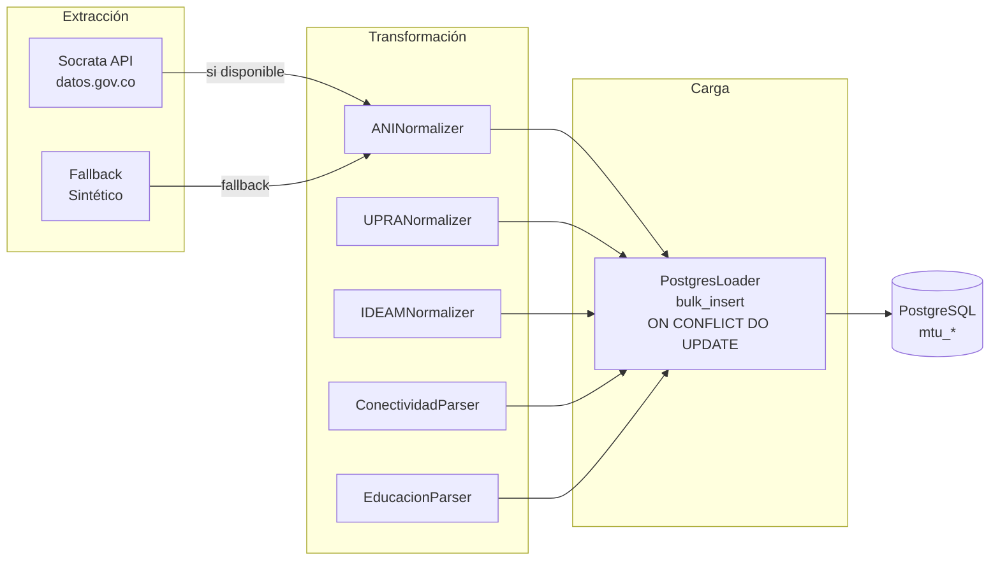

# Kwesx AI — Documentación del Pipeline ETL

**Flujo:** Extracción → Transformación → Carga  
**Orquestador:** `etl/pipeline.py`  
**Fuentes:** 5 datasets de datos abiertos del gobierno colombiano

---

## Arquitectura del ETL



---

## Fuentes de datos

### 1. ANI — Tráfico Vehicular

| Campo | Valor |
|---|---|
| **Archivo** | `etl/extractors/ani.py` |
| **Dataset ID** | `8yi9-t44c` |
| **URL** | `https://www.datos.gov.co/resource/8yi9-t44c.json` |
| **Tabla destino** | `mtu_ani` |
| **Conflict key** | `(peaje, categoria_tarifa, fecha_inicio, fecha_fin)` |
| **Registros** | ~151,000 |

**Campos extraídos:** nombre del peaje, categoría de vehículo, fechas, tarifas, volúmenes de tráfico.  
**Enriquecimiento:** geocodificación con coordenadas lat/lon desde tabla interna.

### 2. UPRA — Precios de Insumos Agrícolas

| Campo | Valor |
|---|---|
| **Archivo** | `etl/extractors/upra.py` |
| **Dataset ID** | `gwbi-fnzs` |
| **URL** | `https://www.datos.gov.co/resource/gwbi-fnzs.json` |
| **Tabla destino** | `mtu_upra` |
| **Conflict key** | `(fecha)` |
| **Registros** | ~89 meses |

**Campos extraídos:** índice total, variación mensual, subíndices por categoría (fertilizantes, plaguicidas, semillas, combustible).

### 3. IDEAM — Clima

| Campo | Valor |
|---|---|
| **Archivo** | `etl/extractors/ideam.py` |
| **Tabla destino** | `mtu_ideam` |
| **Conflict key** | `(nombre_estacion, fecha, tipo_variable)` |

**Datasets:**
- Precipitación: `s54a-sgyg`
- Temperatura: `sbwg-7ju4`

**Campos extraídos:** estación meteorológica, fecha, valor observado, unidad de medida, zona hidrográfica.

### 4. Conectividad — Brecha Digital

| Campo | Valor |
|---|---|
| **Archivo** | `backend/etl/extractors/dane_mintic.py` |
| **Tabla destino** | `mtu_conectividad` |
| **Conflict key** | `(codigo_dane, anio, tipo_conexion, zona)` |
| **Fuentes** | DANE ECV + MinTIC |

### 5. Educación — Cobertura Escolar

| Campo | Valor |
|---|---|
| **Archivo** | `backend/etl/extractors/men.py` |
| **Tabla destino** | `mtu_educacion` |
| **Conflict key** | `(codigo_dane, anio, nivel_educativo, zona)` |
| **Fuente** | MEN-SIMAT |

---

## Patrón de fallback

Todos los extractores siguen el mismo patrón:

```python
try:
    # 1. Intentar API real de Socrata
    datos = socrata_client.get(dataset_id, limit=50000, app_token=token)
    fuente = "ANI"
except Exception:
    # 2. Fallback a datos sintéticos realistas
    datos = generar_sinteticos(seed=2026, n=N_SINTETICOS)
    fuente = "ANI-SIMULADO"  # siempre marcado
```

Los datos sintéticos están calibrados con estadísticas reales de las fuentes originales para mantener distribuciones plausibles.

---

## Ejecución

### Usando Make (recomendado)
```bash
make etl              # Todos los datasets
make etl-ani          # Solo ANI
make etl-upra         # Solo UPRA
make etl-ideam        # Solo IDEAM
make etl-conectividad # Solo conectividad
make etl-educacion    # Solo educación
make etl-dry          # Modo dry-run (sin escribir en BD)
```

### Usando Python directamente
```bash
# Desde la raíz del proyecto, con venv activo

# Pipeline completo
python -m etl.pipeline

# Dataset específico
python -m etl.pipeline --fuente ani
python -m etl.pipeline --fuente upra
python -m etl.pipeline --fuente ideam
python -m etl.pipeline --fuente conectividad
python -m etl.pipeline --fuente educacion

# Con fecha de inicio personalizada
python -m etl.pipeline --fuente ideam --desde 2026-01-01

# Dry-run (extrae y transforma, pero NO escribe en BD)
python -m etl.pipeline --dry-run --fuente upra
```

---

## Estructura de carpetas

```
etl/
├── __init__.py
├── config.py              # Fechas de inicio, variables de configuración
├── pipeline.py            # Orquestador principal
├── extractors/
│   ├── __init__.py        # Exporta ANIExtractor, UPRAExtractor, IDEAMExtractor
│   ├── ani.py             # Extractor ANI (Socrata)
│   ├── upra.py            # Extractor UPRA (Socrata)
│   └── ideam.py           # Extractor IDEAM (Socrata, 2 datasets)
├── transformers/
│   ├── __init__.py        # Exporta normalizadores
│   ├── ani.py             # ANINormalizer → MTU schema
│   ├── upra.py            # UPRANormalizer → MTU schema
│   └── ideam.py           # IDEAMNormalizer → MTU schema
└── loaders/
    ├── __init__.py
    └── postgres.py        # PostgresLoader — carga incremental con UPSERT

backend/etl/extractors/
├── dane_mintic.py         # Extractor conectividad
└── men.py                 # Extractor educación
```

---

## Agregar una nueva fuente de datos

1. **Crear el extractor** en `etl/extractors/nueva_fuente.py`:
```python
class NuevaFuenteExtractor:
    def fetch_from(self, desde: str) -> list[dict]:
        try:
            return socrata_client.get("dataset-id", ...)
        except Exception:
            return generar_sinteticos()
```

2. **Crear el normalizador** en `etl/transformers/nueva_fuente.py`:
```python
class NuevaFuenteNormalizer:
    def transform(self, records: list[dict]) -> list[dict]:
        return [self._normalize(r) for r in records]
    
    def _normalize(self, r: dict) -> dict:
        return {
            "codigo_dane": r.get("codigo_dane"),
            # ... mapear campos al schema MTU
            "fuente": "NUEVA_FUENTE",
        }
```

3. **Crear el modelo** en `backend/app/models/mtu.py`:
```python
class MtuNuevaFuente(Base):
    __tablename__ = "mtu_nueva_fuente"
    id = Column(Integer, primary_key=True, autoincrement=True)
    # ... campos
```

4. **Añadir el loader** en `etl/loaders/postgres.py`:
```python
def load_nueva_fuente(self, registros: list[dict]) -> int:
    return self._bulk_insert(
        MtuNuevaFuente, registros,
        conflict_cols=["codigo_dane", "anio"],
    )
```

5. **Conectar en pipeline.py**:
```python
if args.fuente in ("nueva_fuente", "all"):
    resultados.append(run_nueva_fuente(loader, args.dry_run))
```

6. **Añadir target en Makefile**:
```makefile
etl-nueva-fuente:
    python -m etl.pipeline --fuente nueva_fuente
```
